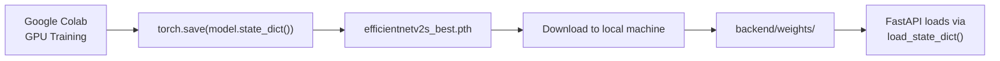
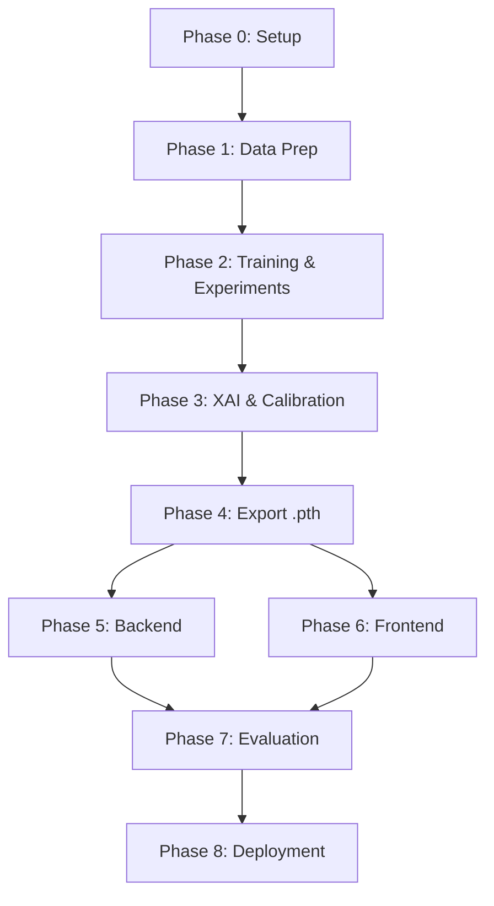

# Implementation Plan — RetinaScreen AI

Companion document: **[README.md](./README.md)** — architecture, tech stack, and reference docs for the finished system. This file is the build order.

Each phase has a goal, a checklist, and a "done when" line. Work through them in order — later phases assume earlier ones are complete (e.g., you can't export a model in Phase 4 that wasn't selected in Phase 2).

---

## Phase 0 — Repo & Environment Setup

**Goal:** a working skeleton, nothing model-specific yet.

- [ ] Create repo with `frontend/`, `backend/`, `notebooks/`, `docs/` structure (see README's [Project Structure](./README.md#project-structure))
- [ ] Google Colab notebook set up, Google Drive mounted for dataset + checkpoint persistence, GPU runtime enabled
- [ ] Local: Python venv for `backend/`, `npx create-next-app` for `frontend/`
- [ ] `.gitignore` excludes `*.pth` (unless using Git LFS), `__pycache__`, `node_modules`, `.env`

**Done when:** you can `uvicorn app.main:app --reload` and `npm run dev` and both start with placeholder routes.

---

## Phase 1 — Data Preparation

**Goal:** a clean, correctly-split dataset, ready for training.

- [ ] Verify class folder structure and counts (600 × 5 = 3,000)
- [ ] Confirm original vs CLAHE pairing — same base image, same eye, enhancement variant only
- [ ] Stratified train/val/test split (e.g. 70/15/15) at the **base-image level**, not the file level, so an image and its CLAHE counterpart always land in the same split (see README's [Dataset](./README.md#dataset) note on leakage)
- [ ] EDA notebook: class balance, sample grid per class, quality distribution
- [ ] Image-quality heuristic (e.g. Laplacian-variance blur score + brightness/exposure check), tag every image `good` / `poor`

**Done when:** you have a manifest (CSV/JSON) mapping each image → class, split, quality tag, and original/CLAHE flag.

---

## Phase 2 — Model Training & Experiments (Google Colab)

**Goal:** pick a winning architecture and preprocessing strategy with evidence, not assumption.

- [ ] Shared training/eval harness — dataset class, transforms, training loop, metrics logging (reuse across every run below)
- [ ] Baselines: ResNet50, DenseNet121
- [ ] Primary comparison: EfficientNetV2-S (2-phase transfer learning — see README's [training recipe](./README.md#model-selection)), ConvNeXt-Tiny, Swin-Tiny
- [ ] Ablation: Original-only vs CLAHE-only vs Original+CLAHE-as-augmentation, same split, same architecture, controlled comparison
- [ ] Score every run on Macro-F1, QWK, and per-class recall on Severe NPDR/PDR — not accuracy
- [ ] Select the winning architecture + preprocessing combo
- [ ] *(Stretch)* Ordinal classification head vs standard softmax on the winning architecture — adopt only if it beats softmax on QWK and severe-class recall

**Done when:** you have a single best checkpoint, and a table of every experiment's metrics to justify why it won (this table becomes the README Results section later).

---

## Phase 3 — Explainability & Calibration

**Goal:** the winning model can explain itself and knows when it's unsure.

- [ ] `pytorch-grad-cam` wired to the winning model's final conv block
- [ ] SHAP `GradientExplainer` wired in — cap background-sample count to keep runtime reasonable
- [ ] Spot-check Grad-CAM vs SHAP agreement on a sample of predictions (Research Question 4)
- [ ] Reliability diagram + Expected Calibration Error (ECE) on the validation set
- [ ] Derive HIGH/LOW certainty thresholds from the calibration data (not arbitrary numbers) and the review-recommendation logic that follows from them

**Done when:** given one image, you can produce a prediction, a Grad-CAM overlay, a SHAP overlay, and a certainty label — all from one function call.

---

## Phase 4 — Export & Package the Model

**Goal:** the trained model is a portable file the backend can load.

- [ ] `torch.save(model.state_dict(), "efficientnetv2s_best.pth")` on Colab
- [ ] Download the `.pth` locally, place in `backend/weights/`
- [ ] `load_model()` in the backend rebuilds the architecture and calls `load_state_dict()` (see README's [Model weights](./README.md#model-weights-colab--local--backend) section — this is not a conversion step, just loading the saved weights)
- [ ] Decide weight-hosting strategy for deployment: Git LFS vs external bucket/Hugging Face Hub (the raw file is ~80–90MB — see README's [Deployment](./README.md#deployment) note)
- [ ] *(Optional)* ONNX export for faster CPU inference on Render

**Done when:** a fresh clone of the repo + the weights file in place can run inference locally with no Colab dependency.

---

## Phase 5 — Backend (FastAPI)

**Goal:** a working `/predict` endpoint matching the README's [API Reference](./README.md#api-reference).

- [ ] `/predict` — upload → quality gate (short-circuit to retake-response if poor) → preprocess → inference → Grad-CAM → SHAP → JSON
- [ ] `/health` — for Render health checks
- [ ] Pydantic response schemas for both the good-quality and poor-quality response shapes
- [ ] CORS configured for the Vercel frontend origin
- [ ] `requirements.txt` + `Dockerfile`

**Done when:** `curl -F file=@sample.jpg localhost:8000/predict` returns a correctly-shaped JSON response for both a good and a deliberately blurry test image.

---

## Phase 6 — Frontend (Next.js)

**Goal:** a clinician can upload an image and read the result without training.

- [ ] Upload screen — drag-drop + preview
- [ ] Results screen — prediction, confidence bar, per-class probability breakdown, quality/certainty badges
- [ ] Grad-CAM / SHAP tab toggle over the fundus image
- [ ] "Professional review recommended" banner, urgency tied to certainty (HIGH → Recommended, LOW → Strongly Recommended)
- [ ] API client with loading and error states (including the retake-requested state)

**Done when:** the full loop — upload, wait, see prediction + both explanation overlays + review banner — works against the local backend.

---

## Phase 7 — Evaluation & Write-Up

**Goal:** answer the Research Questions with numbers, not intuition.

- [ ] Full metrics on the held-out test set: confusion matrix, per-class P/R/F1, QWK, ROC-AUC, PR-AUC
- [ ] Error analysis — prioritize false negatives on Severe/PDR over adjacent-class confusion
- [ ] Quality-stratified metrics (good vs poor images)
- [ ] Write up answers to all 6 [Research Questions](./README.md#research-questions)
- [ ] Fill in the README's Results with real numbers (replace any TBD placeholders)

**Done when:** every Research Question in the README has a one-paragraph, metric-backed answer.

---

## Phase 8 — Deployment

**Goal:** a public URL a healthcare worker could actually open on a tablet.

- [ ] Push to GitHub, weights handled per the Phase 4 decision
- [ ] Render: connect repo, set build/start commands and env vars per README's [Deployment](./README.md#deployment), confirm cold-start behavior is acceptable
- [ ] Vercel: import repo, root directory `frontend/`, set `NEXT_PUBLIC_API_URL`
- [ ] End-to-end smoke test in production: upload → prediction → both explanation overlays render correctly

**Done when:** you can demo the live URL end-to-end without touching localhost.

---

## Full Sequence at a Glance

Phases 5 and 6 (backend, frontend) can run in parallel once Phase 4 produces a checkpoint — the frontend can build against mocked API responses while the backend wiring finishes.
