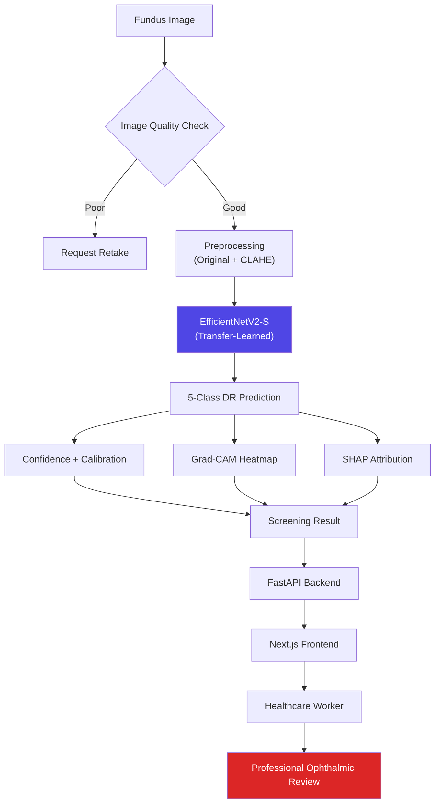
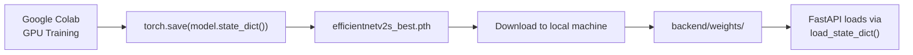

# RetinaScreen AI — Explainable Diabetic Retinopathy Screening


> An explainable, uncertainty-aware deep learning system that grades diabetic retinopathy (DR) severity from retinal fundus images — built to accelerate first-line screening by healthcare workers while keeping a qualified ophthalmologist in the final decision loop.

Companion document: **[IMPLEMENTATION_PLAN.md](./IMPLEMENTATION_PLAN.md)** — the phase-by-phase build checklist for this README.

## Table of Contents
- [Clinical Disclaimer](#clinical-disclaimer)
- [Overview](#overview)
- [Key Features](#key-features)
- [System Architecture](#system-architecture)
- [Research Questions](#research-questions)
- [Model Selection](#model-selection)
- [Tech Stack](#tech-stack)
- [Dataset](#dataset)
- [Explainability (XAI)](#explainability-xai)
- [Calibration & Review Flagging](#calibration--review-flagging)
- [Evaluation Metrics](#evaluation-metrics)
- [Project Structure](#project-structure)
- [Getting Started](#getting-started)
- [API Reference](#api-reference)
- [Deployment](#deployment)
- [Roadmap](#roadmap)
- [License](#license)
- [Acknowledgments](#acknowledgments)

## Clinical Disclaimer

This is a **screening assistance aid**, not a diagnostic device. It helps healthcare workers **triage and prioritize** patients for further evaluation — it does not replace examination by a qualified ophthalmologist or retina specialist, and every prediction requires clinical confirmation before any treatment decision. Grad-CAM and SHAP outputs are **post-hoc explanations of model behavior**, not proof that a highlighted region is a clinically validated lesion — that distinction should be stated explicitly anywhere results are shown. This project has not been evaluated or approved by any regulatory body (CDSCO, FDA, CE, or otherwise) and is not intended for standalone clinical diagnosis.

## Overview

Diabetic retinopathy is a leading cause of preventable blindness in working-age adults, and early-stage disease is often asymptomatic — which is exactly why regular screening matters and why screening bottlenecks (too few specialists, too many patients) are a real problem. RetinaScreen AI takes a fundus photograph, runs it through an image-quality gate, grades DR severity across 5 classes, and returns the prediction alongside two complementary explanations (Grad-CAM + SHAP), a calibrated certainty level, and a recommendation on whether professional review is needed — all before a specialist ever looks at the image.

## Key Features

- 5-class DR severity grading (ICDR scale) from a single fundus photograph
- **Image-quality gate** that requests a retake instead of grading an unusable image
- Grad-CAM heatmaps highlighting the retinal regions driving each prediction
- SHAP attribution as a second, complementary explanation method
- **Calibrated confidence** — a raw softmax score reported alongside a HIGH/LOW certainty flag, not just the number on its own
- Plain-language screening recommendation, with review urgency tied to certainty
- Clean, responsive Next.js UI designed for tablets and low-spec devices in clinic/camp settings
- FastAPI backend, deployed on Render; Next.js frontend on Vercel

## System Architecture



## Research Questions

The build is treated as a set of testable questions, not just an implementation — this is what separates a screening *system* from "trained a CNN on a dataset." Each is answered empirically in Phase 7 of the [Implementation Plan](./IMPLEMENTATION_PLAN.md):

1. **Does CLAHE preprocessing improve classification over raw fundus images?** — Original-only vs CLAHE-only vs Original+CLAHE-as-augmentation.
2. **Which pretrained backbone generalizes best on this dataset?** — EfficientNetV2-S vs ConvNeXt-Tiny vs Swin-Tiny vs ResNet50/DenseNet121 baselines.
3. **Does modeling DR severity as ordinal (rather than purely categorical) improve grading?** — standard softmax vs an ordinal classification head.
4. **Do Grad-CAM and SHAP agree on what's driving a prediction?** — cross-check explanation consistency rather than reporting each in isolation.
5. **How does performance degrade on lower-quality images?** — metrics stratified by the image-quality score.
6. **How well-calibrated are the model's confidence scores?** — reliability diagrams + Expected Calibration Error, not raw softmax alone.

## Model Selection

**Primary: EfficientNetV2-S**, ImageNet-pretrained, fine-tuned in two phases — benchmarked against a deliberately staged comparison set rather than picked and shipped on assumption:

| Architecture | Role | Grad-CAM Fit | Data Efficiency | Notes |
|---|---|---|---|---|
| **EfficientNetV2-S** | **Primary** | Native | High | Best accuracy/compute trade-off at ~3k images; standard backbone in DR-grading literature |
| ConvNeXt-Tiny | Comparison / ensemble candidate | Native | High | Modernized CNN, competitive with transformers, stays Grad-CAM-friendly |
| Swin-Tiny | Comparison only | Needs Attention Rollout | Lower | Run for the experiment, not for production — attention-based explanations are coarser than Grad-CAM |
| ResNet50 | Baseline | Native | High | Classic baseline to quantify what the modern backbones actually buy you |
| DenseNet121 | Baseline | Native | High | Second baseline; dense connectivity sometimes helps on small medical datasets |

Pick the deployed model by **Macro-F1 + Quadratic Weighted Kappa (QWK) + per-class recall on Severe NPDR/PDR** — not raw accuracy. A model that's 96% accurate but misses proliferative cases is worse than one that's 91% accurate and catches them.

**Why EfficientNetV2-S as the default:** proven track record on retinal fundus grading (backbone of choice in most top APTOS 2019 / EyePACS solutions), Grad-CAM works natively on its conv feature maps with no adaptation layer, and transfer learning converges well even at ~600 images/class — training any of these from scratch on 3,000 images will almost certainly overfit.

**Minimal architecture swap-in:**
```python
import torchvision.models as models
import torch.nn as nn

model = models.efficientnet_v2_s(weights="IMAGENET1K_V1")
model.classifier[1] = nn.Linear(model.classifier[1].in_features, 5)
```

**Suggested training recipe:**
1. Freeze the backbone, train only the classification head for 5–10 epochs (warm-up).
2. Unfreeze the top 30–40% of layers, fine-tune end-to-end at a low LR (1e-4 → 1e-5, cosine decay).
3. Plain cross-entropy is fine while classes stay balanced at 600/class; switch to class-weighted or focal loss if that changes later.
4. Early-stop on validation QWK, not validation loss.

**On ordinal classification (Research Question 3):** DR severity has a natural order (No DR → Mild → Moderate → Severe → PDR) that a standard softmax head doesn't explicitly encode. Worth one clean experiment with an ordinal head — adopt it only if it beats the standard model on QWK and severe-class recall, otherwise keep softmax. Don't ship it on theoretical appeal alone.

## Tech Stack

**Frontend:** Next.js (App Router) + TypeScript + Tailwind CSS + shadcn/ui
**Backend:** FastAPI + Python 3.10+ + Uvicorn
**Deep Learning:** PyTorch + torchvision (EfficientNetV2-S transfer learning)
**Explainability:** `pytorch-grad-cam`, `shap`
**Image Processing:** OpenCV, Pillow, Albumentations (augmentation), CLAHE (contrast enhancement)
**Deployment:** Vercel (frontend), Render (backend + model serving)
**Model Serving:** raw PyTorch `.pth` checkpoint; ONNX export optional for faster CPU inference on Render

## Dataset

| Index | Standard ICDR Grade | Your Original Label | Images |
|---|---|---|---|
| 0 | No DR | No DR | 600 |
| 1 | Mild NPDR | Mild DR | 600 |
| 2 | Moderate NPDR | Moderate DR | 600 |
| 3 | Severe NPDR | Non-Proliferative DR | 600 |
| 4 | Proliferative DR (PDR) | Severe/Final DR | 600 |

**Total: 3,000 images, perfectly class-balanced (600/class).** The right-hand column maps to the standard International Clinical Diabetic Retinopathy (ICDR) severity scale, since "Mild" and "Moderate" are themselves non-proliferative stages — worth confirming against your actual label source before training.

**Original + CLAHE pairing:** if each base image has both an original and a CLAHE-enhanced version, split at the **base-image level**, not the file level, so an image and its CLAHE counterpart always land in the same split. Letting one go to train and its pair go to test is data leakage — they're derived from the same underlying photograph and will inflate validation metrics.

**Size considerations (3,000 images is small for deep learning):**
- Transfer learning only — don't train any of the comparison backbones from random init.
- Augmentation: rotation (±15–20°), horizontal and vertical flips (fundus images have no fixed canonical orientation, so both are standard in DR literature), mild brightness/contrast jitter. Keep hue/color jitter minimal — DR grading depends on subtle color cues (microaneurysms, exudates, hemorrhages) that aggressive color augmentation can wash out.
- Stratified k-fold CV (e.g., 5-fold) instead of a single split, for a more reliable generalization estimate.
- External validation on an independent public dataset (IDRiD, Messidor-2) before treating results as evidence of real-world performance.

## Explainability (XAI)

**Grad-CAM** — spatial heatmap over the fundus image showing which regions drove the prediction (microaneurysms, hemorrhages, hard exudates, neovascularization). Fast enough to compute per-request; this is the primary visual explanation shown to the healthcare worker.

**SHAP** — pixel/patch-level attribution via `GradientExplainer` on the trained CNN, a complementary and more granular view. SHAP on image models is noticeably more compute-heavy than Grad-CAM (multiple forward/backward passes per explanation) — run it as an on-demand "deeper explanation" rather than on every default prediction, to keep response latency reasonable on Render's lower tiers.

**Cross-check, don't just report both in isolation** (Research Question 4): when Grad-CAM and SHAP disagree on the driving region, that disagreement is itself worth surfacing — it's a signal the prediction may be less trustworthy, not just a footnote.

Both maps are shown as overlays on the original fundus image, with the disclaimer that they explain model behavior, not confirmed clinical findings.

## Calibration & Review Flagging

Raw softmax confidence isn't automatically trustworthy — a model can be 98% confident and wrong. Compute a reliability diagram and Expected Calibration Error (ECE) on the validation set, then derive certainty thresholds from that data (not arbitrary cutoffs) to drive the UI:

```
Prediction: Moderate DR       Prediction: Moderate DR
Confidence: 91.4%             Confidence: 52.1%
Certainty: HIGH                Certainty: LOW
Review: Recommended            Review: Strongly Recommended
```

Low-certainty predictions should be flagged more assertively for professional review than high-certainty ones — the UI's urgency language should track calibrated certainty, not the raw class prediction alone.

## Evaluation Metrics

Accuracy alone is not sufficient for a clinical screening tool. Track and report:

- **Per-class Precision, Recall, F1** — especially **recall (sensitivity) on Severe NPDR and PDR**. A missed severe case (false negative) is far costlier than an unnecessary referral (false positive).
- **Quadratic Weighted Kappa (QWK)** — the standard metric in DR-grading literature (APTOS/EyePACS competitions), since it accounts for the ordinal severity scale — misclassifying No DR as PDR should be penalized more than Mild vs Moderate.
- **Confusion matrix**, with explicit attention to far-class errors (e.g., predicted No DR when actual is PDR) over adjacent-class errors.
- **ROC-AUC / PR-AUC** (one-vs-rest per class).
- **Calibration** — reliability diagram + ECE (see above).
- **Quality-stratified performance** (Research Question 5) — report metrics separately for high- vs low-quality images, don't average them away.

## Project Structure

```
retinascreen-ai/
├── backend/
│   ├── app/
│   │   ├── main.py
│   │   ├── models/
│   │   │   ├── inference.py
│   │   │   ├── gradcam.py
│   │   │   └── shap_explainer.py
│   │   ├── preprocessing/
│   │   │   ├── quality_check.py
│   │   │   └── retinal_preprocessing.py
│   │   ├── schemas/
│   │   └── routers/
│   │       ├── predict.py
│   │       └── health.py
│   ├── weights/
│   │   └── efficientnetv2s_best.pth      # not committed raw — see Deployment
│   ├── requirements.txt
│   └── Dockerfile
├── frontend/
│   ├── app/
│   ├── components/
│   ├── lib/
│   └── package.json
├── notebooks/
│   ├── 01_eda.ipynb
│   ├── 02_training_colab.ipynb
│   └── 03_evaluation.ipynb
├── docs/
├── .env.example
├── IMPLEMENTATION_PLAN.md
└── README.md
```

## Getting Started

### Prerequisites
- Python 3.10+, Node.js 18+
- A trained `efficientnetv2s_best.pth` (see below)

### Model weights (Colab → local → backend)
Training happens on Google Colab (GPU), not locally:



`.pth` isn't a converted/exported format — it's the raw saved `state_dict` (the learned weights) from `torch.save()`. Loading it just means instantiating the same architecture and calling `load_state_dict()`:

```python
import torch
import torchvision.models as models
import torch.nn as nn

def load_model(weights_path: str, num_classes: int = 5, device: str = "cpu"):
    model = models.efficientnet_v2_s(weights=None)
    model.classifier[1] = nn.Linear(model.classifier[1].in_features, num_classes)
    model.load_state_dict(torch.load(weights_path, map_location=device))
    model.eval()
    return model.to(device)
```

Drop the downloaded `.pth` into `backend/weights/` before starting the backend.

### Backend Setup
```bash
cd backend
python -m venv venv && source venv/bin/activate
pip install -r requirements.txt
uvicorn app.main:app --reload
```

### Frontend Setup
```bash
cd frontend
npm install
npm run dev
```

## API Reference

### `POST /predict`
`multipart/form-data` — `file: image`

**Good-quality response:**
```json
{
  "prediction": "Moderate DR",
  "class_index": 2,
  "confidence": 0.914,
  "probabilities": {
    "No DR": 0.010,
    "Mild DR": 0.040,
    "Moderate DR": 0.914,
    "Severe DR": 0.025,
    "Proliferative DR": 0.011
  },
  "certainty": "HIGH",
  "review_recommendation": "Recommended",
  "image_quality": "good",
  "gradcam_overlay": "base64-encoded-png",
  "shap_overlay": "base64-encoded-png",
  "model_version": "efficientnetv2s-v1"
}
```

**Poor-quality response (inference skipped):**
```json
{
  "image_quality": "poor",
  "quality_issues": ["blurry", "underexposed"],
  "message": "Image quality insufficient for reliable grading. Please retake."
}
```

### `GET /health`
Health check for Render's uptime monitoring.

## Deployment

### Backend → Render
1. Connect the repo as a Web Service. Build: `pip install -r requirements.txt`. Start: `uvicorn app.main:app --host 0.0.0.0 --port $PORT`.
2. Set `PYTHON_VERSION` in the Render dashboard.
3. **Weights file:** EfficientNetV2-S's `.pth` is roughly 80–90MB as raw float32 weights — right at GitHub's file-size limit. Use Git LFS for it, or host it externally (Hugging Face Hub / a storage bucket) and download it at container startup, rather than committing it directly.
4. Free/hobby-tier instances are typically CPU-only with cold starts on inactivity — export to ONNX (`onnxruntime`) if inference latency becomes an issue.
5. Add the Vercel frontend URL to CORS allowed origins in `main.py`.

### Frontend → Vercel
1. Import the repo, set root directory to `frontend/`.
2. Set `NEXT_PUBLIC_API_URL` to the Render backend URL.
3. Deploys automatically on push to `main`.

## Roadmap

- [ ] Expand the dataset via public sources (APTOS 2019, EyePACS, IDRiD, Messidor-2)
- [ ] External validation on an independent dataset
- [ ] Model quantization for faster low-resource deployment
- [ ] Multi-language UI support
- [ ] Batch screening mode for camp-style screening drives

## License

MIT — adjust if you have different requirements.

## Acknowledgments

Dataset source: *(fill in — e.g., APTOS 2019 Blindness Detection / EyePACS / IDRiD / custom collection)*
