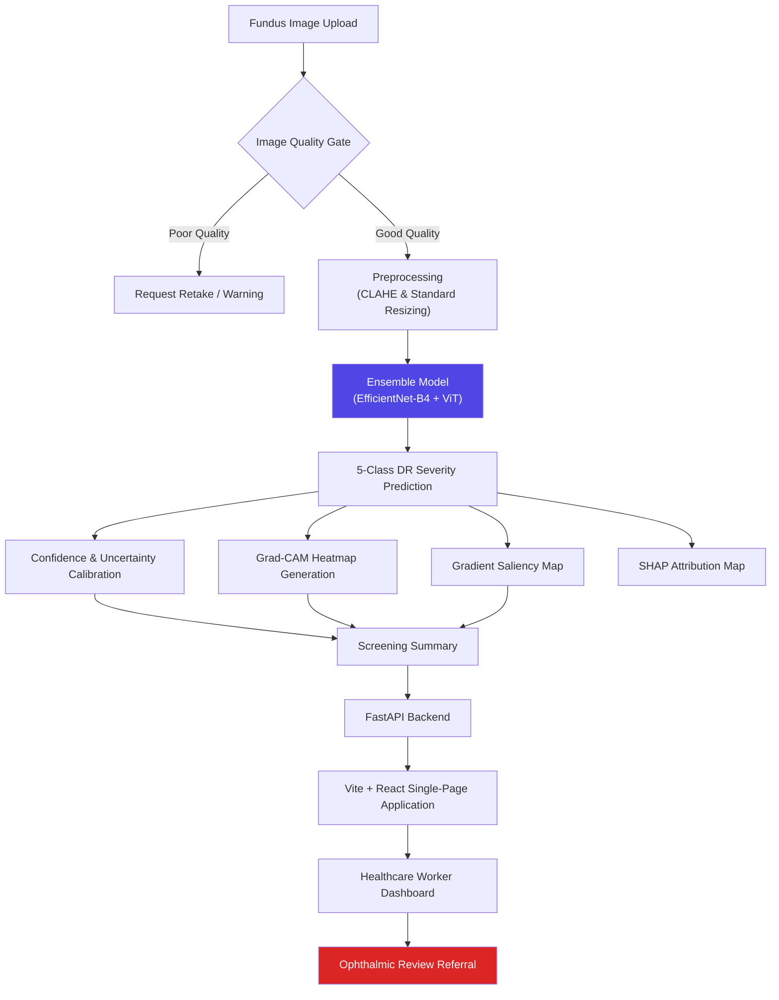

# RetinaScreen AI — Explainable Diabetic Retinopathy Screening


> An explainable, uncertainty-aware deep learning system that grades diabetic retinopathy (DR) severity from retinal fundus images — built to accelerate first-line screening by healthcare workers while keeping a qualified ophthalmologist in the final decision loop.

Companion document: **[IMPLEMENTATION_PLAN.md](./IMPLEMENTATION_PLAN.md)** — the phase-by-phase build checklist for this project.

---

## Table of Contents
- [Clinical Disclaimer](#clinical-disclaimer)
- [Overview](#overview)
- [Key Features](#key-features)
- [System Architecture](#system-architecture)
- [Research Questions](#research-questions)
- [Model Selection](#model-selection)
- [Tech Stack](#tech-stack)
- [Dataset](#dataset)
- [Explainability (XAI)](#explainability-xai)
- [Calibration & Review Flagging](#calibration--review-flagging)
- [Evaluation Metrics](#evaluation-metrics)
- [Project Structure](#project-structure)
- [Getting Started](#getting-started)
- [API Reference](#api-reference)
- [Deployment](#deployment)
- [Roadmap](#roadmap)
- [License](#license)

---

## Clinical Disclaimer

This is a **screening assistance aid**, not a diagnostic device. It helps healthcare workers **triage and prioritize** patients for further evaluation — it does not replace examination by a qualified ophthalmologist or retina specialist, and every prediction requires clinical confirmation before any treatment decision. Grad-CAM and SHAP outputs are **post-hoc explanations of model behavior**, not proof that a highlighted region is a clinically validated lesion — that distinction should be stated explicitly anywhere results are shown. This project has not been evaluated or approved by any regulatory body (CDSCO, FDA, CE, or otherwise) and is not intended for standalone clinical diagnosis.

---

## Overview

Diabetic retinopathy is a leading cause of preventable blindness in working-age adults, and early-stage disease is often asymptomatic — which is exactly why regular screening matters and why screening bottlenecks (too few specialists, too many patients) are a real problem. RetinaScreen AI takes a fundus photograph, runs it through an image-quality gate, grades DR severity across 5 classes, and returns the prediction alongside two complementary explanations (Grad-CAM + SHAP), a calibrated certainty level, and a recommendation on whether professional review is needed — all presented in a fast, responsive React dashboard.

---

## Key Features

- **5-Class DR Severity Grading** (ICDR scale: No DR, Mild, Moderate, Severe, PDR) from a single fundus photograph.
- **Image-Quality Gate**: Evaluates focus, contrast, and exposure to request a retake instead of grading an unusable image.
- **Triple XAI Explanations**:
  - **Grad-CAM**: Spatial heatmaps highlighting visual regions driving predictions.
  - **Gradient Saliency**: Pixel-level sensitivity maps displaying first-order input gradients.
  - **SHAP**: Game-theoretic Shapley attributions rendering positive (risk-elevating) and negative (protective) feature contributions.
- **Calibrated Confidence**: Raw softmax reported alongside a HIGH/LOW certainty flag.
- **Screening Recommendations**: Plain-language guidance with urgency tied to model certainty.
- **Modern React + Vite Frontend**: High-performance, single-page UI built with React, TypeScript, Tailwind CSS, and Lucide icons.
- **Production-Ready Architecture**: FastAPI backend ready for Render deployment and React frontend optimized for Vercel/Netlify.

---

## System Architecture



---

## Research Questions

1. **Does CLAHE preprocessing improve classification over raw fundus images?** — Evaluated via Original-only vs. CLAHE-enhanced pipelines.
2. **Which pretrained backbone generalizes best on this dataset?** — EfficientNet-B4 vs. ViT-B16 vs. ConvNeXt baselines.
3. **Does ensemble modeling outperform single architectures?** — Weighted probability averaging of EfficientNet-B4 and ViT.
4. **Do Grad-CAM and SHAP agree on feature attribution?** — Cross-verifying explainability regions for diagnostic confidence.
5. **How does performance degrade on lower-quality images?** — Stratified performance evaluation across image quality metrics.
6. **How well-calibrated are confidence scores?** — Reliability diagrams + Expected Calibration Error (ECE).

---

## Tech Stack

### Frontend
- **Framework:** React 18 (Vite SPA architecture)
- **Language:** TypeScript
- **Styling:** Tailwind CSS + PostCSS
- **Icons & UI:** Lucide React icons, Tailwind Merge, `clsx`
- **Build Tool:** Vite 5

### Backend & AI Pipeline
- **API Server:** FastAPI + Uvicorn + Pydantic v2
- **Deep Learning Framework:** TensorFlow 2.15+ / Keras 3
- **Architectures:** EfficientNet-B4 & Vision Transformer (ViT)
- **Explainability (XAI):** `tf-explain` (Grad-CAM), `shap`
- **Image Processing:** OpenCV (`opencv-python-headless`), Pillow, Albumentations

### Deployment & Infrastructure
- **Frontend Hosting:** Vercel / Static Web Hosting
- **Backend Hosting:** Render / Docker container
- **Model Storage:** Keras format (`.keras`), configuration JSONs

---

## Dataset

- **Format:** Retinal Fundus Photographs (Original & CLAHE processed)
- **Classes (5-Grade ICDR Scale):**
  1. `0` - No DR
  2. `1` - Mild NPDR
  3. `2` - Moderate NPDR
  4. `3` - Severe NPDR
  5. `4` - Proliferative DR (PDR)
- **Preprocessing:** Contrast Limited Adaptive Histogram Equalization (CLAHE) applied to green-channel extracted fundus photographs for lesion enhancement.

---

## Explainability (XAI)

- **Grad-CAM**: Generates coarse localization heatmaps indicating regions (e.g. microaneurysms, hemorrhages, hard exudates) influencing the network's prediction.
- **Gradient Saliency**: Computes input-pixel sensitivity gradients $\left|\frac{\partial y_c}{\partial x}\right|$ for fine-grained structure verification.
- **SHAP (SHapley Additive exPlanations)**: Solves spatial KernelSHAP linear regression over image superpixel coalitions, outputting positive (red) and negative (blue) Shapley feature attributions.
- **Interactive Viewer**: The React frontend provides side-by-side comparative views with tabs and interactive visual legends for clinical inspection.

---

## Project Structure

```
DR Classification/
├── backend/
│   ├── app/
│   │   ├── main.py
│   │   ├── models/
│   │   │   ├── inference.py
│   │   │   ├── gradcam.py
│   │   │   ├── saliency_explainer.py
│   │   │   └── shap_explainer.py
│   │   ├── preprocessing/
│   │   │   ├── quality_check.py
│   │   │   └── retinal_preprocessing.py
│   │   ├── schemas/
│   │   │   └── prediction.py
│   │   └── routers/
│   │       ├── predict.py
│   │       └── health.py
│   ├── weights/
│   │   ├── .gitkeep
│   │   ├── efficientnet_b4_config.json
│   │   └── ensemble_efficientnet_b4_vit_b16_config.json
│   ├── requirements.txt
│   └── Dockerfile
├── frontend/
│   ├── src/
│   │   ├── components/
│   │   │   ├── confidence-bar.tsx
│   │   │   ├── explanation-viewer.tsx
│   │   │   ├── results-panel.tsx
│   │   │   └── upload-zone.tsx
│   │   ├── lib/
│   │   │   └── api.ts
│   │   ├── App.tsx
│   │   ├── index.css
│   │   ├── main.tsx
│   │   └── vite-env.d.ts
│   ├── index.html
│   ├── package.json
│   ├── vite.config.ts
│   ├── tailwind.config.ts
│   ├── tsconfig.json
│   └── vercel.json
├── notebooks/
│   ├── 01_eda.ipynb
│   ├── 02_training_colab.ipynb
│   ├── 03_evaluation.ipynb
│   └── Unified_DR_Pipeline.ipynb
├── .env.example
├── .gitignore
├── IMPLEMENTATION_PLAN.md
└── README.md
```

---

## Getting Started

### 1. Prerequisites
- **Node.js** (v18+) & **npm**
- **Python** (v3.10+)

### 2. Backend Setup
```bash
cd backend
python -m venv venv

# On Windows (PowerShell):
.\venv\Scripts\Activate.ps1
# On Linux/macOS:
source venv/bin/activate

pip install -r requirements.txt
uvicorn app.main:app --reload --port 8000
```
The FastAPI backend will run at `http://localhost:8000`. API docs available at `http://localhost:8000/docs`.

### 3. Frontend Setup (React + Vite)
```bash
cd frontend
npm install
npm run dev
```
The React development server will start at `http://localhost:5173`.

---

## API Reference

### `POST /predict`
Accepts a retinal fundus image (`multipart/form-data`) and returns grading predictions, calibration flags, and base64-encoded XAI visual overlays.

### `GET /health`
Returns system status, active model configuration, and backend readiness.

---

## Deployment

- **Frontend (Vite + React)**: Deploy to Vercel, Netlify, or AWS S3/CloudFront. Set environment variable `VITE_API_URL` to point to the backend URL.
- **Backend (FastAPI)**: Deploy to Render, Railway, or Fly.io using Docker or direct Python execution. Ensure `.keras` weight files are placed in `backend/weights/`.

---

## License

This project is licensed under the [MIT License](LICENSE).
