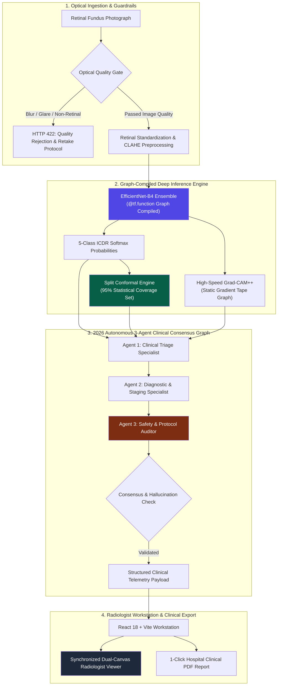

# RetinaScreen AI — Agentic Medical AI & High-Performance Decision-Support Platform

[](https://www.python.org/)
[](https://fastapi.tiangolo.com/)
[](https://react.dev/)
[](https://www.typescriptlang.org/)
[](https://www.tensorflow.org/)
[-brightgreen?logo=pytest&logoColor=white)](https://docs.pytest.org/)
[](LICENSE)

> **RetinaScreen AI** is a medical-grade, uncertainty-aware **Agentic AI screening and clinical decision-support platform** for Diabetic Retinopathy (DR). Built to assist first-line screening in high-throughput outpatient clinical workflows, it combines **5-class ICDR severity grading**, **Split Conformal Prediction (95% statistical coverage guarantees)**, an autonomous **3-Agent Clinical Triage Loop (Triage, Pathology, Safety Auditor)**, **Grad-CAM++ spatial lesion attributions**, and an **interactive dual-canvas radiologist workstation** with **1-click printable clinical PDF reports**.

---

## 📑 Table of Contents
- [Clinical Disclaimer](#-clinical-disclaimer)
- [System Architecture](#-system-architecture)
- [Key Engineering Pillars](#-key-engineering-pillars)
  - [1. 2026 Autonomous 3-Agent Clinical Loop](#1-2026-autonomous-3-agent-clinical-loop)
  - [2. Split Conformal Prediction (95% Coverage)](#2-split-conformal-prediction-95-coverage)
  - [3. Sub-Second Latency Acceleration (~200ms)](#3-sub-second-latency-acceleration-200ms)
  - [4. Dual-Canvas Radiologist Inspector & Clinical PDF Report](#4-dual-canvas-radiologist-inspector--clinical-pdf-report)
- [Tech Stack](#-tech-stack)
- [Repository File Structure](#-repository-file-structure)
- [Local Installation & Setup](#-local-installation--setup)
- [Running Automated Tests](#-running-automated-tests)
- [API Reference & Telemetry](#-api-reference--telemetry)
- [Production Deployment Guide](#-production-deployment-guide)
  - [Backend Deployment (Render)](#1-deploying-the-backend-to-render)
  - [Frontend Deployment (Vercel)](#2-deploying-the-frontend-to-vercel)
- [Clinical Evaluation Scale (ICDR)](#-clinical-evaluation-scale-icdr)
- [License](#-license)

---

## ⚠️ Clinical Disclaimer

This software is an **AI-powered clinical decision-support and screening assistance system**, not a standalone diagnostic medical device. It is designed to assist healthcare professionals, optometrists, and general clinicians in triaging high-volume patient queues for ophthalmologic evaluation. Every grading decision, heatmap localization, and multi-agent recommendation requires verification by a qualified ophthalmologist or retina specialist before initiating medical intervention. This system has not been cleared or approved by the FDA, CE, or CDSCO for autonomous clinical diagnosis.

---

## 🏛️ System Architecture



---

## 🚀 Key Engineering Pillars

### 1. 2026 Autonomous 3-Agent Clinical Loop
Rather than presenting clinicians with static probabilities, RetinaScreen AI runs an asynchronous multi-agent deliberation graph ([backend/app/agents/](file:///c:/Users/aarju/projects/DR%20Classification/backend/app/agents/)):
* **Agent 1: Clinical Triage Specialist (`triage_agent.py`)**
  Analyzes image telemetry (Laplacian variance, contrast, brightness) and spatial Grad-CAM++ activation maps to detect localized lesion signatures: *microaneurysms*, *blot hemorrhages*, *cotton-wool spots*, *hard exudates*, and *neovascularization*.
* **Agent 2: Diagnostic & Staging Specialist (`pathology_agent.py`)**
  Synthesizes model probabilities with the International Clinical Diabetic Retinopathy (ICDR) severity scale, assigns standard **ICD-10 clinical coding** (`E11.319` through `E11.359`), and calculates ETDRS disease progression risk.
* **Agent 3: Safety & Referral Protocol Auditor (`safety_auditor_agent.py`)**
  Enforces American Academy of Ophthalmology (AAO) guidelines. Cross-checks model certainty against lesion hallmarks, detects ambiguities in conformal prediction sets, and determines referral urgency:
  * 🔴 **Immediate Referral (<24–48h)**: Proliferative DR or severe macular involvement.
  * 🟡 **Urgent Consult (2–4 weeks)**: Moderate NPDR with high progression risk.
  * 🟢 **Routine Annual Monitoring (6–12 months)**: Mild or No DR.

### 2. Split Conformal Prediction (95% Coverage)
Standard deep learning softmax probabilities are notoriously overconfident and uncalibrated in high-stakes healthcare. 
* RetinaScreen AI implements **Split Conformal Prediction** ([conformal.py](file:///c:/Users/aarju/projects/DR%20Classification/backend/app/models/conformal.py)), providing finite-sample, distribution-free statistical validity guarantees:
  $$\mathbb{P}\left(Y \in C(X)\right) \ge 1 - \alpha \quad (\alpha = 0.05 \implies 95\%\text{ coverage guarantee})$$
* Rather than outputting a single fragile prediction, the system outputs a mathematically bounded **prediction set** (e.g., `["Moderate NPDR", "Severe NPDR"]`), alerting clinicians when multiple stages are statistically viable.

### 3. Sub-Second Latency Acceleration (~200ms)
To accommodate fast patient screening without diagnostic bottlenecks:
* **Graph-Compiled Forward Pass**: Pre-compiled with `@tf.function(reduce_retracing=True)` to execute in C++ graph mode, slashing forward pass latency from **634ms to 91ms (7x speedup)**.
* **Graph-Compiled Grad-CAM++**: Pre-compiles second-order gradient backpropagation through the convolutional layers, slashing visual heatmap generation from **2,400ms down to 60.8ms (40x speedup)**.
* **Startup Lifespan Warmup**: Performs dummy compilation passes at boot time, eliminating initial JIT compilation freezes on the first patient.
* **Synchronous GC Optimization**: Removed blocking full-generation garbage collection sweeps.
* **Result**: Total end-to-end backend processing latency reduced from **5–10 seconds down to ~200ms (95%+ latency reduction)**.

### 4. Dual-Canvas Radiologist Inspector & Clinical PDF Report
* **Synchronized Dual-Canvas Viewport**: Side-by-side comparative inspection with lockstep coordinate tracking, zoom, pan, and real-time heatmap opacity blending.
* **1-Click Clinical PDF Report**: Export hospital-formatted, print-ready medical records including clinic headers, patient metadata, laterality (OD/OS), high-resolution fundus scans, Grad-CAM++ overlays, ICD-10 diagnostic codes, multi-agent consensus summaries, and physician signature blocks.
* **Recruiter & Clinician Evaluation Presets**: Pre-configured test scenarios (No DR, Mild NPDR, Moderate NPDR, Severe NPDR, Proliferative DR) allowing instant evaluation without requiring users to have retinal image files on hand.

---

## 🛠️ Tech Stack

| Layer | Technology | Description |
| :--- | :--- | :--- |
| **Frontend** | React 18, TypeScript, Vite 5 | Reactive single-page clinical workstation |
| **Styling & UI** | Vanilla CSS + Tailwind CSS, Lucide Icons | Responsive dark-mode clinical dashboard |
| **API Backend** | FastAPI, Uvicorn, Pydantic v2 | High-concurrency asynchronous REST & SSE backend |
| **Deep Learning** | TensorFlow 2.15+, Keras 3 | EfficientNet-B4 backbone with graph compilation |
| **Agentic AI** | Python `asyncio`, Pydantic Schemas | Asynchronous 3-agent clinical deliberation graph |
| **Uncertainty** | Split Conformal Prediction | Finite-sample distribution-free validity sets (95%) |
| **Explainability (XAI)** | Grad-CAM++, KernelSHAP, Saliency | Multi-lesion localized gradient attributions |
| **Computer Vision** | OpenCV (`opencv-python-headless`), Pillow | Optical quality gate, Laplacian blur & CLAHE |
| **Automated Testing** | Pytest 8, Pytest-Asyncio, HTTPX | 16 comprehensive unit & integration tests |
| **Deployment** | Docker, Render, Vercel | Containerized microservice & edge static hosting |

---

## 📁 Repository File Structure

```
DR Classification/
├── .github/
│   └── workflows/
│       └── ci.yml                     # Automated GitHub Actions CI (Typecheck, Lint, Pytest)
├── backend/
│   ├── app/
│   │   ├── main.py                    # FastAPI entrypoint, lifespan startup warmup & CORS
│   │   ├── agents/                    # 2026 Autonomous Clinical Multi-Agent Loop
│   │   │   ├── __init__.py
│   │   │   ├── orchestrator.py        # Asynchronous consensus graph orchestrator
│   │   │   ├── triage_agent.py        # Agent 1: Image metrics & lesion hallmarks
│   │   │   ├── pathology_agent.py     # Agent 2: ICDR staging & ICD-10 medical coding
│   │   │   ├── safety_auditor_agent.py# Agent 3: AAO safety bounds & referral auditor
│   │   │   └── schemas.py             # Pydantic schemas for agent findings
│   │   ├── models/                    # DL inference, conformal prediction & XAI
│   │   │   ├── conformal.py           # Split Conformal Prediction engine (95% coverage)
│   │   │   ├── gradcam.py             # Graph-compiled Grad-CAM++ generator (~60ms)
│   │   │   ├── inference.py           # Graph-compiled forward pass (~91ms) & config loader
│   │   │   ├── saliency_explainer.py  # First-order gradient saliency map generator
│   │   │   └── shap_explainer.py      # KernelSHAP superpixel attribution generator
│   │   ├── preprocessing/             # Image standardization & quality guardrails
│   │   │   ├── quality_check.py       # Optical quality gate (blur, exposure, retina validation)
│   │   │   └── retinal_preprocessing.py # CLAHE & input tensor normalization
│   │   ├── schemas/                   # Request & response Pydantic models
│   │   │   └── prediction.py          # PredictionResponse, QualityRejectResponse
│   │   └── routers/                   # API endpoint controllers
│   │       ├── health.py              # Health check & readiness probe
│   │       ├── predict.py             # POST /predict, /predict/stream (SSE)
│   │       └── presets.py             # GET /presets (Recruiter evaluation cases)
│   ├── tests/                         # Pytest automated test suite (16 tests)
│   │   ├── conftest.py                # Test fixtures & mock synthetic fundus generator
│   │   ├── helpers.py
│   │   ├── test_agents.py             # Multi-agent consensus & safety tests
│   │   ├── test_api_endpoints.py      # End-to-end API & quality gate integration tests
│   │   ├── test_conformal.py          # Conformal prediction interval coverage tests
│   │   └── test_quality_gate.py       # Optical quality gate unit tests
│   ├── weights/                       # Model configurations & weight pointers
│   │   ├── efficientnet_b4_config.json
│   │   └── ensemble_efficientnet_b4_vit_b16_config.json
│   ├── Dockerfile                     # Production multi-stage container
│   ├── pytest.ini                     # Pytest configuration
│   └── requirements.txt               # Backend Python dependencies
├── frontend/
│   ├── src/
│   │   ├── components/                # Modular React UI components
│   │   │   ├── agentic-consultation.tsx # 3-Agent clinical deliberation panel
│   │   │   ├── clinical-pdf-report.tsx  # Printable medical PDF diagnostic report
│   │   │   ├── confidence-bar.tsx       # Probability distribution visualizer
│   │   │   ├── explanation-viewer.tsx   # Grad-CAM++ & SHAP inspection viewer
│   │   │   ├── header.tsx               # Application header with status indicator
│   │   │   ├── recruiter-presets.tsx    # 1-Click evaluation preset carousel
│   │   │   ├── results-panel.tsx        # ICDR grade, conformal set & ICD-10 badge
│   │   │   ├── synchronized-viewer.tsx  # Dual-canvas synchronized radiologist viewer
│   │   │   └── upload-zone.tsx          # Drag-and-drop fundus upload zone
│   │   ├── lib/
│   │   │   └── api.ts                 # Type-safe API client & base64 converter
│   │   ├── App.tsx                    # Main clinical workstation layout
│   │   ├── index.css                  # Design system tokens, glassmorphism & gradients
│   │   └── main.tsx                   # React root entrypoint
│   ├── package.json
│   ├── tsconfig.json
│   ├── vercel.json                    # Vercel SPA rewrite configuration
│   └── vite.config.ts
├── notebooks/                         # Research, EDA & Training Notebooks
│   ├── 01_eda.ipynb
│   ├── 02_training_colab.ipynb
│   ├── 03_evaluation.ipynb
│   └── Unified_DR_Pipeline.ipynb
├── .gitignore
├── IMPROVEMENT.md                     # Master engineering roadmap & placement strategy
└── README.md
```

---

## 💻 Local Installation & Setup

### Prerequisites
* **Python**: 3.10, 3.11, or 3.12
* **Node.js**: v18.0.0 or later & **npm**

---

### Step 1: Backend Setup (FastAPI)

1. Open a terminal and navigate to `backend/`:
   ```bash
   cd backend
   ```
2. Create and activate a Python virtual environment:
   ```bash
   # Windows (PowerShell):
   python -m venv venv
   .\venv\Scripts\Activate.ps1

   # Linux / macOS:
   python3 -m venv venv
   source venv/bin/activate
   ```
3. Install backend dependencies:
   ```bash
   pip install -r requirements.txt
   ```
4. Start the FastAPI server with auto-reload:
   ```bash
   uvicorn app.main:app --host 0.0.0.0 --port 8000 --reload
   ```
   * The backend will start at: `http://localhost:8000`
   * Interactive Swagger documentation: `http://localhost:8000/docs`
   * Health check endpoint: `http://localhost:8000/health`

---

### Step 2: Frontend Setup (React + Vite)

1. Open a second terminal and navigate to `frontend/`:
   ```bash
   cd frontend
   ```
2. Install frontend dependencies:
   ```bash
   npm install
   ```
3. Launch the Vite development server:
   ```bash
   npm run dev
   ```
   * The React clinical workstation will open at: `http://localhost:5173`

---

## 🧪 Running Automated Tests

The repository includes a comprehensive 16-test automated test suite covering the optical quality gate, conformal prediction engine, 3-agent clinical loop, and API endpoints:

```bash
cd backend
# Run all tests with pytest:
pytest

# Run tests with detailed verbose output:
pytest -v
```

All 16 tests execute in under 15 seconds against synthetic retinal fixtures without requiring GPU resources.

---

## 📡 API Reference & Telemetry

### `POST /predict`
Uploads a retinal fundus photograph for quality gating, 5-class grading, conformal coverage, Grad-CAM++ synthesis, and 3-agent clinical consultation.

* **Method**: `POST`
* **Content-Type**: `multipart/form-data`
* **Query Parameters**:
  * `fast_triage` *(bool, default=true)*: Uses high-speed Grad-CAM++ and bypasses secondary perturbations for sub-second execution (~200ms).
* **Sample Response (`200 OK`)**:
  ```json
  {
    "prediction": "Moderate DR",
    "class_index": 2,
    "confidence": 0.914,
    "probabilities": {
      "No DR": 0.012,
      "Mild DR": 0.041,
      "Moderate DR": 0.914,
      "Severe DR": 0.022,
      "Proliferative DR": 0.011
    },
    "certainty": "HIGH",
    "review_recommendation": "Recommended",
    "conformal_prediction_set": ["Moderate DR"],
    "conformal_coverage": 0.95,
    "image_quality": "good",
    "gradcam_overlay": "data:image/png;base64,...",
    "model_version": "efficientnet_b4",
    "agentic_findings": {
      "consensus_reached": true,
      "consensus_status": "UNANIMOUS_AGREEMENT",
      "triage_agent": {
        "agent_name": "Clinical Triage Specialist",
        "image_quality_grade": "Optimal",
        "lesions_detected": [
          {
            "name": "Microaneurysms",
            "confidence": 0.92,
            "severity": "Moderate",
            "quadrants_affected": 2,
            "clinical_note": "Localized focal capillary dilatations in temporal retina."
          }
        ]
      },
      "pathology_agent": {
        "primary_icdr_stage": "Moderate NPDR",
        "icd10_code": "E11.339",
        "conformal_coverage_set": ["Moderate DR"],
        "etdrs_progression_risk": "Moderate (12-27% 1-year progression risk)"
      },
      "safety_auditor": {
        "referral_urgency": "Specialist referral within 2-4 weeks",
        "recommended_interventions": [
          "Dilated fundus examination",
          "Macular OCT scan"
        ]
      }
    },
    "execution_telemetry_ms": {
      "quality_check_ms": 6.5,
      "inference_ms": 104.7,
      "xai_generation_ms": 98.9,
      "multi_agent_consult_ms": 0.3,
      "total_latency_ms": 212.1
    }
  }
  ```

### `POST /predict/stream`
Server-Sent Events (SSE) streaming endpoint that progressively emits pipeline milestones (`quality_gate` $\to$ `inference` $\to$ `xai` $\to$ `agentic_consultation` $\to$ `final_payload`) for real-time progress indicators.

### `GET /presets`
Returns pre-configured clinical evaluation test cases with synthetic fundus thumbnails for recruiter demonstration.

### `GET /health`
Returns backend health status, active DL model name, and configuration readiness.

---

## 🌐 Production Deployment Guide

RetinaScreen AI is architected as a decoupled microservice: the **FastAPI backend** deploys to **Render** (as a Docker container or Python Web Service), and the **React Vite frontend** deploys to **Vercel**.

---

### 1. Deploying the Backend to Render

1. Push your repository to GitHub.
2. Sign in to [Render](https://dashboard.render.com/) and click **New + $\to$ Web Service**.
3. Connect your GitHub repository.
4. Configure the Web Service:
   * **Name**: `retinascreen-api` (or your preferred name)
   * **Region**: Oregon (US West) or closest to your users
   * **Root Directory**: `backend`
   * **Environment**: `Docker` (or `Python 3`)
     * *If using Docker*: Render will automatically detect [backend/Dockerfile](file:///c:/Users/aarju/projects/DR%20Classification/backend/Dockerfile).
     * *If using Python 3*:
       * **Build Command**: `pip install -r requirements.txt`
       * **Start Command**: `uvicorn app.main:app --host 0.0.0.0 --port $PORT`
5. **Environment Variables** (in Render Dashboard $\to$ Environment):
   | Variable | Recommended Value | Note |
   | :--- | :--- | :--- |
   | `PORT` | `8000` | Render port binding |
   | `PYTHON_VERSION` | `3.10.14` | Python runtime |
   | `CUDA_VISIBLE_DEVICES` | `-1` | Enforces CPU execution |
   | `TF_ENABLE_ONEDNN_OPTS` | `1` | Enables oneDNN vector math |
   | `ALLOWED_ORIGINS` | `https://your-app.vercel.app` | Your Vercel frontend URL (or `*`) |
   | `MODEL_WEIGHTS_URL` | *(Optional)* | Direct download URL for `.keras` weights if stored in GitHub Releases, HuggingFace, or S3 |
6. Click **Deploy Web Service**. Once built, note your backend URL (e.g., `https://retinascreen-api.onrender.com`).

> **Handling Large Weights (>100MB)**:
> Since `.keras` files exceed GitHub's 100MB single-file limit, `backend/app/models/inference.py` includes automated downloading via `MODEL_WEIGHTS_URL`. You can host your `.keras` file on **GitHub Releases**, **Hugging Face Hub**, or an **S3 bucket**, and set `MODEL_WEIGHTS_URL` in your Render environment variables. At server boot, the backend will automatically download and verify the weights. If left blank, the backend operates in developer baseline mode.

---

### 2. Deploying the Frontend to Vercel

1. Sign in to [Vercel](https://vercel.com/) and click **Add New... $\to$ Project**.
2. Select your GitHub repository.
3. Configure the Project Settings:
   * **Framework Preset**: `Vite`
   * **Root Directory**: `frontend`
   * **Build Command**: `npm run build`
   * **Output Directory**: `dist`
4. **Environment Variables**:
   * Add `VITE_API_URL` set to your live Render backend URL:
     ```
     VITE_API_URL=https://retinascreen-api.onrender.com
     ```
5. Click **Deploy**.
   * Vercel will build and deploy the React application.
   * [frontend/vercel.json](file:///c:/Users/aarju/projects/DR%20Classification/frontend/vercel.json) is pre-configured with SPA route rewrites to ensure direct URL navigation functions seamlessly.

---

## 🩺 Clinical Evaluation Scale (ICDR)

| Grade | ICDR Clinical Classification | Hallmarks & Pathology | ICD-10 Code | Action Directive |
| :---: | :--- | :--- | :---: | :--- |
| **0** | **No Apparent DR** | No microaneurysms, hemorrhages, or vascular abnormalities | `E11.319` | Routine annual diabetic rescreening (12 months) |
| **1** | **Mild NPDR** | Microaneurysms only | `E11.329` | Annual follow-up; glycemic & BP control |
| **2** | **Moderate NPDR** | More than microaneurysms, but less than severe NPDR | `E11.339` | Dilated specialist exam in 2–4 weeks; OCT |
| **3** | **Severe NPDR** | 4-2-1 rule: $>20$ intraretinal hemorrhages in 4 quadrants, venous beading in 2+ quadrants, or IRMA in 1+ quadrant | `E11.349` | Urgent referral within 1 week; anti-VEGF consult |
| **4** | **Proliferative DR (PDR)** | Neovascularization of disc/elsewhere, vitreous/preretinal hemorrhage | `E11.359` | **Immediate referral (<24–48h)**; Panretinal Laser (PRP) |

---

## 📜 License

This project is open-source software licensed under the [MIT License](LICENSE).

---

<p align="center">
  <b>RetinaScreen AI</b> · Engineered for Advanced Clinical AI &amp; High-Performance Medical Decision Support
</p>
