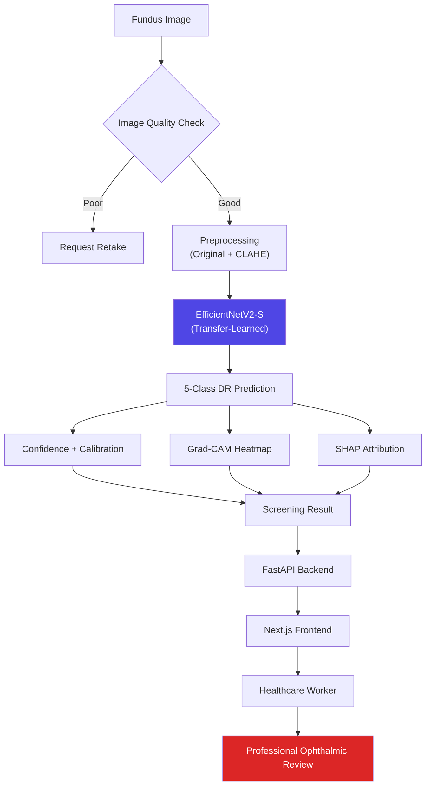

# RetinaScreen AI — Explainable Diabetic Retinopathy Screening


> An explainable, uncertainty-aware deep learning system that grades diabetic retinopathy (DR) severity from retinal fundus images — built to accelerate first-line screening by healthcare workers while keeping a qualified ophthalmologist in the final decision loop.

Companion document: **[IMPLEMENTATION_PLAN.md](./IMPLEMENTATION_PLAN.md)** — the phase-by-phase build checklist for this README.

## Table of Contents
- [Clinical Disclaimer](#clinical-disclaimer)
- [Overview](#overview)
- [Key Features](#key-features)
- [System Architecture](#system-architecture)
- [Research Questions](#research-questions)
- [Model Selection](#model-selection)
- [Tech Stack](#tech-stack)
- [Dataset](#dataset)
- [Explainability (XAI)](#explainability-xai)
- [Calibration & Review Flagging](#calibration--review-flagging)
- [Evaluation Metrics](#evaluation-metrics)
- [Project Structure](#project-structure)
- [Getting Started](#getting-started)
- [API Reference](#api-reference)
- [Deployment](#deployment)
- [Roadmap](#roadmap)
- [License](#license)
- [Acknowledgments](#acknowledgments)

## Clinical Disclaimer

This is a **screening assistance aid**, not a diagnostic device. It helps healthcare workers **triage and prioritize** patients for further evaluation — it does not replace examination by a qualified ophthalmologist or retina specialist, and every prediction requires clinical confirmation before any treatment decision. Grad-CAM and SHAP outputs are **post-hoc explanations of model behavior**, not proof that a highlighted region is a clinically validated lesion — that distinction should be stated explicitly anywhere results are shown. This project has not been evaluated or approved by any regulatory body (CDSCO, FDA, CE, or otherwise) and is not intended for standalone clinical diagnosis.

## Overview

Diabetic retinopathy is a leading cause of preventable blindness in working-age adults, and early-stage disease is often asymptomatic — which is exactly why regular screening matters and why screening bottlenecks (too few specialists, too many patients) are a real problem. RetinaScreen AI takes a fundus photograph, runs it through an image-quality gate, grades DR severity across 5 classes, and returns the prediction alongside two complementary explanations (Grad-CAM + SHAP), a calibrated certainty level, and a recommendation on whether professional review is needed — all before a specialist ever looks at the image.

## Key Features

- 5-class DR severity grading (ICDR scale) from a single fundus photograph
- **Image-quality gate** that requests a retake instead of grading an unusable image
- Grad-CAM heatmaps highlighting the retinal regions driving each prediction
- SHAP attribution as a second, complementary explanation method
- **Calibrated confidence** — a raw softmax score reported alongside a HIGH/LOW certainty flag, not just the number on its own
- Plain-language screening recommendation, with review urgency tied to certainty
- Clean, responsive Next.js UI designed for tablets and low-spec devices in clinic/camp settings
- FastAPI backend, deployed on Render; Next.js frontend on Vercel

## System Architecture



## Research Questions

The build is treated as a set of testable questions, not just an implementation — this is what separates a screening *system* from "trained a CNN on a dataset." Each is answered empirically in Phase 7 of the [Implementation Plan](./IMPLEMENTATION_PLAN.md):

1. **Does CLAHE preprocessing improve classification over raw fundus images?** — Original-only vs CLAHE-only vs Original+CLAHE-as-augmentation.
2. **Which pretrained backbone generalizes best on this dataset?** — EfficientNetV2-S vs ConvNeXt-Tiny vs Swin-Tiny vs ResNet50/DenseNet121 baselines.
3. **Does modeling DR severity as ordinal (rather than purely categorical) improve grading?** — standard softmax vs an ordinal classification head.
4. **Do Grad-CAM and SHAP agree on what's driving a prediction?** — cross-check explanation consistency rather than reporting each in isolation.
5. **How does performance degrade on lower-quality images?** — metrics stratified by the image-quality score.
6. **How well-calibrated are the model's confidence scores?** — reliability diagrams + Expected Calibration Error, not raw softmax alone.

## Model Selection

**Primary: EfficientNetV2-S**, ImageNet-pretrained, fine-tuned in two phases — benchmarked against a deliberately staged comparison set rather than picked and shipped on assumption:

| Architecture | Role | Grad-CAM Fit | Data Efficiency | Notes |
|---|---|---|---|---|
| **EfficientNetV2-S** | **Primary** | Native | High | Best accuracy/compute trade-off at ~3k images; standard backbone in DR-grading literature |
| ConvNeXt-Tiny | Comparison / ensemble candidate | Native | High | Modernized CNN, competitive with transformers, stays Grad-CAM-friendly |
| Swin-Tiny | Comparison only | Needs Attention Rollout | Lower | Run for the experiment, not for production — attention-based explanations are coarser than Grad-CAM |
| ResNet50 | Baseline | Native | High | Classic baseline to quantify what the modern backbones actually buy you |
| DenseNet121 | Baseline | Native | High | Second baseline; dense connectivity sometimes helps on small medical datasets |

Pick the deployed model by **Macro-F1 + Quadratic Weighted Kappa (QWK) + per-class recall on Severe NPDR/PDR** — not raw accuracy. A model that's 96% accurate but misses proliferative cases is worse than one that's 91% accurate and catches them.

## Tech Stack

**Frontend:** Next.js (App Router) + TypeScript + Tailwind CSS
**Backend:** FastAPI + Python 3.10+ + Uvicorn
**Deep Learning:** PyTorch + torchvision (EfficientNetV2-S transfer learning)
**Explainability:** `pytorch-grad-cam`, `shap`
**Image Processing:** OpenCV, Pillow, Albumentations (augmentation), CLAHE (contrast enhancement)
**Deployment:** Vercel (frontend), Render (backend + model serving)

## Project Structure

```
DR Classification/
├── backend/
│   ├── app/
│   │   ├── main.py
│   │   ├── models/
│   │   │   ├── inference.py
│   │   │   ├── gradcam.py
│   │   │   └── shap_explainer.py
│   │   ├── preprocessing/
│   │   │   ├── quality_check.py
│   │   │   └── retinal_preprocessing.py
│   │   ├── schemas/
│   │   │   └── prediction.py
│   │   └── routers/
│   │       ├── predict.py
│   │       └── health.py
│   ├── weights/
│   │   └── efficientnetv2s_best.pth
│   ├── requirements.txt
│   └── Dockerfile
├── frontend/
│   ├── app/
│   │   ├── layout.tsx
│   │   ├── page.tsx
│   │   └── globals.css
│   ├── components/
│   │   ├── header.tsx
│   │   ├── upload-zone.tsx
│   │   ├── results-panel.tsx
│   │   ├── explanation-viewer.tsx
│   │   └── confidence-bar.tsx
│   ├── lib/
│   │   └── api.ts
│   └── package.json
├── notebooks/
│   ├── 01_eda.ipynb
│   ├── 02_training_colab.ipynb
│   └── 03_evaluation.ipynb
├── docs/
├── .env.example
├── .gitignore
├── IMPLEMENTATION_PLAN.md
└── README.md
```

## Getting Started

### Backend Setup
```bash
cd backend
python -m venv venv
# On Linux/macOS: source venv/bin/activate
# On Windows: venv\Scripts\activate
pip install -r requirements.txt
uvicorn app.main:app --reload
```

### Frontend Setup
```bash
cd frontend
npm install
npm run dev
```

## License
MIT
